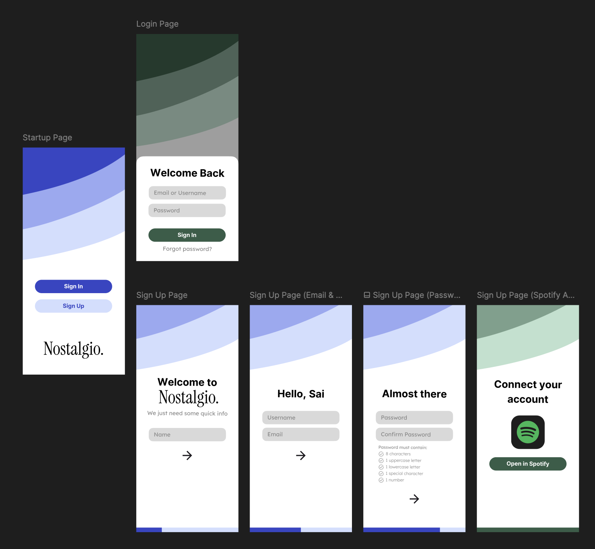

# Sai Chauhan
Develop a React Native front-end landing page solution that mimics an pre-designated figma design, and attach some object oriented back-end pseudocode that connects the front-end with a user database. 

[](https://www.figma.com/design/ZqlTzn4VME2w1itFbPkcaF/Nostalgio?node-id=1-2)
- [Link to custom-made Figma design](https://www.figma.com/design/ZqlTzn4VME2w1itFbPkcaF/Nostalgio?node-id=1-2)
- [Link to Figma wireframing and prototyping](https://www.figma.com/proto/ZqlTzn4VME2w1itFbPkcaF/Nostalgio?node-id=52-13&p=f&t=TePDkta2kRgyXTSB-1&scaling=scale-down&content-scaling=fixed&page-id=1%3A2&starting-point-node-id=52%3A13)

# Demo
| Sign In Flow | Sign Up Flow |
|-------------|-------------|
| [](https://github.com/ChauhanSai/next-play-oa/tree/main/frontend/nextPlayOA) | [](https://github.com/ChauhanSai/next-play-oa/tree/main/frontend/nextPlayOA) |

# Psuedocode
<a href="https://github.com/ChauhanSai/next-play-oa/blob/main/backend/backend.md">
  
</a>

- [Link to Express.js object oriented back-end pseudocode](backend/backend.md)

# Running the React Native app:

**1. In Terminal:**

```cd nextPlayOA```

**2. Then install dependencies:**

```npm install```

**3. Start the Expo dev server**

```npx expo start```

**a. Run on iOS Simulator:** With Expo running, press ```i``` in the terminal

**b. Run on a iPhone (Expo Go App):** Install Expo Go from the App Store, open Expo Go on your iPhone, scan the QR code shown in Terminal or browser
